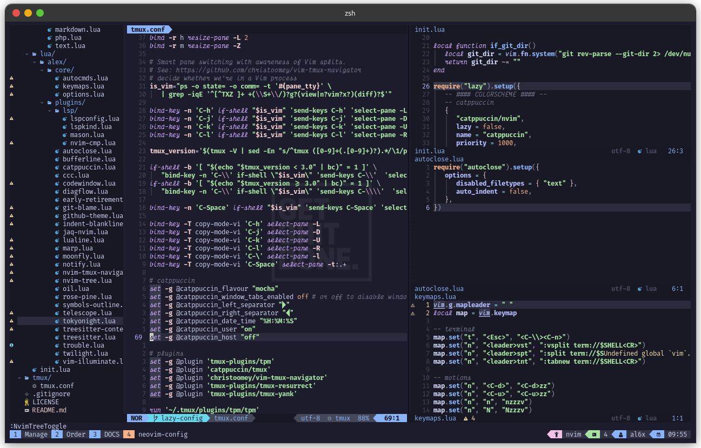

# My Neovim Setup

My neovim setup and development workflow

<br>


### Screenshots

I don't own this "GET SHIT DONE" wallpaper and it's not part of the config. It's in my
```kitty.conf``` to avoid copyright stuff, I will not include the image


With TMUX


## Table of Contents

* [Dependencies](#dependencies)
* [Installation](#installation)
* [Plugins](#plugins)
   + [Navigation](#navigation)
   + [Syntax Highlighting](#syntax-highlighting)
   + [LSP or Auto-Completion](#lsp-or-auto-completion)
   + [Aesthetic or Interface](#aesthetic-or-interface)
   + [Colorscheme](#colorscheme)
   + [Git Integration](#git-integration)
   + [Quality of Life](#quality-of-life)
* [Configured LSPs](#configured-lsps)
   + [How to Install LSPs and Do a Basic Configuration](#how-to-install-lsps-and-do-a-basic-configuration)

<br>


### Dependencies

* [Kitty Terminal](https://github.com/kovidgoyal/kitty) (coz it supports font ligature and other utf-8 characters)
* neovim v0.8.+
* [lazy](https://github.com/folke/lazy.nvim) as the plugin manager
* [Fira Code Nerd Font](https://github.com/ryanoasis/nerd-fonts/tree/master/patched-fonts/FiraCode)
   and [Victor Mono Font](https://github.com/rubjo/victor-mono) for sweet cursive italics
   (configured in Kitty's ```kitty.conf```)
   ```
      font_family Fira Code Regular
      bold_font Fira Code Bold
      italic_font Victor Mono SemiBold Italic
      bold_italic_font Victor Mono Bold Italic
   ```
* live-server (for nvim-markdown-preview, install by ```npm i -g live-server```)

<br>


### Installation

Enter these commands in the terminal.
```bash
git clone https://github.com/alexxShandsome/neovim-config
cd neovim-config
mkdir -v ~/.config/nvim
cp -vr nvim ~/.config/
```

**Note:** This config doesn't fully work in Windows

<br>


### Plugins

I use [```lazy```](https://github.com/folke/lazy.nvim) as a Plugin Manager

#### Navigation

* [junegunn/fzf                   ](https://github.com/junegunn/fzf)
* [ibhagwan/fzf-lua               ](https://github.com/ibhagwan/fzf-lua)
* [alexghergh/nvim-tmux-navigation](https://github.com/alexghergh/nvim-tmux-navigation)
* [sitiom/nvim-numbertoggle       ](https://github.com/sitiom/nvim-numbertoggle)
* [nvim-tree/nvim-tree.lua        ](https://github.com/nvim-tree/nvim-tree.lua)
* [simrat39/symbols-outline.nvim  ](https://github.com/simrat39/symbols-outline.nvim)
* [folke/trouble.nvim             ](https://github.com/folke/trouble.nvim)

#### Syntax Highlighting

* [nvim-treesitter/nvim-treesitter](https://github.com/nvim-treesitter/nvim-treesitter)
* [mtdl9/vim-log-highlighting     ](https://github.com/MTDL9/vim-log-highlighting)

#### LSP or Auto-Completion

* [gregsexton/MatchTag               ](https://github.com/gregsexton/MatchTag)
* [AndrewRadev/tagalong.vim.git      ](https://github.com/AndrewRadev/tagalong.vim)
* [windwp/nvim-ts-autotag            ](https://github.com/windwp/nvim-ts-autotag)
* [williamboman/mason.nvim           ](https://github.com/williamboman/mason.nvim)
* [williamboman/mason-lspconfig.nvim ](https://github.com/williamboman/mason-lspconfig.nvim)
* [neovim/nvim-lspconfig             ](https://github.com/neovim/nvim-lspconfig)
* [hrsh7th/cmp-nvim-lsp              ](https://github.com/hrsh7th/cmp-nvim-lsp)
* [hrsh7th/cmp-buffer                ](https://github.com/hrsh7th/cmp-buffer)
* [hrsh7th/cmp-path                  ](https://github.com/hrsh7th/cmp-path)
* [hrsh7th/cmp-cmdline               ](https://github.com/hrsh7th/cmp-cmdline)
* [hrsh7th/nvim-cmp                  ](https://github.com/hrsh7th/nvim-cmp)
* [hrsh7th/cmp-vsnip                 ](https://github.com/hrsh7th/cmp-vsnip)
* [hrsh7th/vim-vsnip                 ](https://github.com/hrsh7th/vim-vsnip)
* [m4xshen/autoclose.nvim            ](https://github.com/m4xshen/autoclose.nvim)
* [lukas-reineke/cmp-under-comparator](https://github.com/lukas-reineke/cmp-under-comparator)
* [rafamadriz/friendly-snippets      ](https://github.com/rafamadriz/friendly-snippets)

#### Aesthetic or Interface

* [lukas-reineke/indent-blankline.nvim    ](https://github.com/lukas-reineke/indent-blankline.nvim)
* [nvim-lualine/lualine.nvim              ](https://github.com/nvim-lualine/lualine.nvim)
* [akinsho/bufferline.nvim                ](https://github.com/akinsho/bufferline.nvim)
* [SmiteshP/nvim-navic                    ](https://github.com/SmiteshP/nvim-navic)
* [nvim-tree/nvim-web-devicons            ](https://github.com/nvim-tree/nvim-web-devicons)
* [gorbit99/codewindow.nvim               ](https://github.com/gorbit99/codewindow.nvim)
* [rcarriga/nvim-notify                   ](https://github.com/rcarriga/nvim-notify)
* [NMAC427/guess-indent.nvim              ](https://github.com/NMAC427/guess-indent.nvim)
* [nvim-treesitter/nvim-treesitter-context](https://github.com/nvim-treesitter/nvim-treesitter-context)
* [folke/twilight.nvim                    ](https://github.com/folke/twilight.nvim)
* [onsails/lspkind.nvim                   ](https://github.com/onsails/lspkind.nvim)

#### Colorscheme

* [catppuccin/nvim            ](https://github.com/catppuccin/nvim)
* [bluz71/vim-moonfly-colors  ](https://github.com/bluz71/vim-moonfly-colors)
* [folke/tokyonight.nvim      ](https://github.com/folke/tokyonight.nvim)
* [projekt0n/github-nvim-theme](https://github.com/projekt0n/github-nvim-theme)
* [rose-pine/neovim           ](https://github.com/rose-pine/neovim)
* [yorik1984/newpaper.nvim    ](https://github.com/yorik1984/newpaper.nvim)

#### Git Integration

* [tpope/vim-fugitive     ](https://github.com/tpope/vim-fugitive)
* [idanarye/vim-merginal  ](https://github.com/idanarye/vim-merginal)
* [lewis6991/gitsigns.nvim](https://github.com/lewis6991/gitsigns.nvim)
* [f-person/git-blame.nvim](https://github.com/f-person/git-blame.nvim)

#### Quality of Life

* [uga-rosa/ccc.nvim                   ](https://github.com/uga-rosa/ccc.nvim)
* [numToStr/Comment.nvim               ](https://github.com/numToStr/Comment.nvim)
* [nullchilly/fsread.nvim              ](https://github.com/nullchilly/fsread.nvim)
* [davidgranstrom/nvim-markdown-preview](https://github.com/davidgranstrom/nvim-markdown-preview)
* [RRethy/vim-illuminate               ](https://github.com/RRethy/vim-illuminate)
* [chrisgrieser/nvim-early-retirement  ](https://github.com/chrisgrieser/nvim-early-retirement)
* [is0n/jaq-nvim                       ](https://github.com/is0n/jaq-nvim)
* [kylechui/nvim-surround              ](https://github.com/kylechui/nvim-surround)
* [stevearc/oil.nvim                   ](https://github.com/stevearc/oil.nvim)
* [aca/marp.nvim                       ](https://github.com/aca/marp.nvim)
* [f3fora/cmp-spell                    ](https://github.com/f3fora/cmp-spell)
* [dgagn/diagflow.nvim                 ](https://github.com/dgagn/diagflow.nvim)

<br>


### Configured LSPs

You can follow the full guide [here](https://github.com/neovim/nvim-lspconfig/blob/master/doc/server_configurations.md).
```npm``` is a hard dependency. If you already installed ```npm``` then just do a ```:MasonInstall <lsp>```.

* [pyright](https://github.com/neovim/nvim-lspconfig/blob/master/doc/server_configurations.md#pyright) (python)
   + ```python3``` and is required.
* [jdtls](https://github.com/neovim/nvim-lspconfig/blob/master/doc/server_configurations.md#jdtls) (java)
   + ```java-devel``` is required.
* [html](https://github.com/neovim/nvim-lspconfig/blob/master/doc/server_configurations.md#html) (html)
* [clangd](https://github.com/neovim/nvim-lspconfig/blob/master/doc/server_configurations.md#clangd) (c/c++, objc, objcpp, cuda, proto)
   + ```clang``` is required.
* [lua_ls](https://github.com/neovim/nvim-lspconfig/blob/master/doc/server_configurations.md#sumneko_lua) (lua)
   + ```lua``` is required.
* [intelephense](https://github.com/neovim/nvim-lspconfig/blob/master/doc/server_configurations.md#intelephense) (php)
* [vimls](https://github.com/neovim/nvim-lspconfig/blob/master/doc/server_configurations.md#vimls) (vimscript)
* [cssls](https://github.com/neovim/nvim-lspconfig/blob/master/doc/server_configurations.md#cssls) (css, scss, less)
* [marksman](https://github.com/neovim/nvim-lspconfig/blob/master/doc/server_configurations.md#marksman) (markdown)
* [texlab](https://github.com/neovim/nvim-lspconfig/blob/master/doc/server_configurations.md#html) (LaTeX)
* [tailwindcss](https://github.com/neovim/nvim-lspconfig/blob/master/doc/server_configurations.md#tailwindcss) (tailwind, etc.)
* [bashls](https://github.com/neovim/nvim-lspconfig/blob/master/doc/server_configurations.md#bashls) (zsh, bash, sh)
* [lemminx](https://github.com/neovim/nvim-lspconfig/blob/master/doc/server_configurations.md#lemminx) (xml, xsd, xsl, xslt, svg)

#### How to Install LSPs and Do a Basic Configuration

Using the [```mason.nvim```](https://github.com/williamboman/mason.nvim) plugin and acts
as the lsp mananger, type ```:MasonInstall <lsp-name or the programming language name>```
inside Neovim. Then, open the ```nvim/lua/alex/plugins/lsp/lspconfig.lua``` and add the lsp
client inside the ```LSP_LIST``` table.

```lua
local LSP_LIST = {
   "pyright",
   "jdtls",
   "html",
   "clangd",
   "lua_ls",
   "intelephense",
   "vimls",
   "cssls",
   "marksman",
   "texlab",
   "tailwindcss",
   "bashls",
   "lemminx",
	"quick_lint_js",
	"tsserver",
   "<add lsp name here>"
}

```

The lsp clients will be looped to do a basic configuration.

```lua
-- loop all the avaibale lsp inside LSP_LIST
for _, lsp_server in pairs(LSP_LIST) do
   -- basic configuration for installed lsp servers
   lspconfig[lsp_server].setup{
      capabilities = cmp_capabilities,
      on_attach = on_attach,
   }

   -- custom lsp configuration below

   if lsp_server == "bashls" then
      lspconfig[lsp_server].setup{
         capabilities = cmp_capabilities,
         on_attach = on_attach,
         filetypes = {'zsh', 'bash', 'sh'}
      }
   end
end
```

<br>
