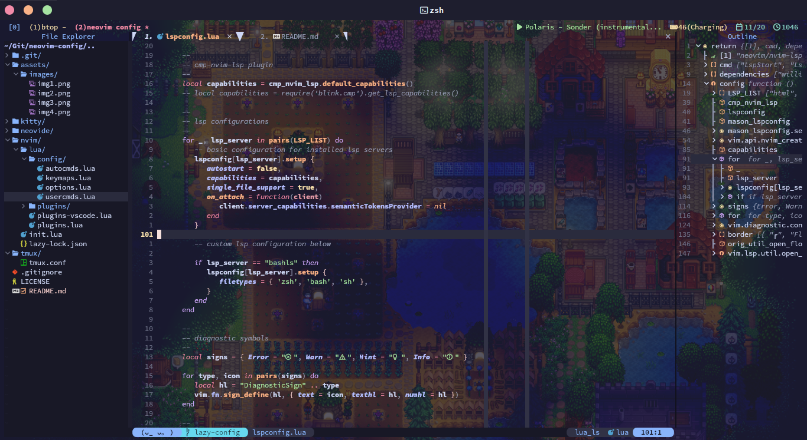
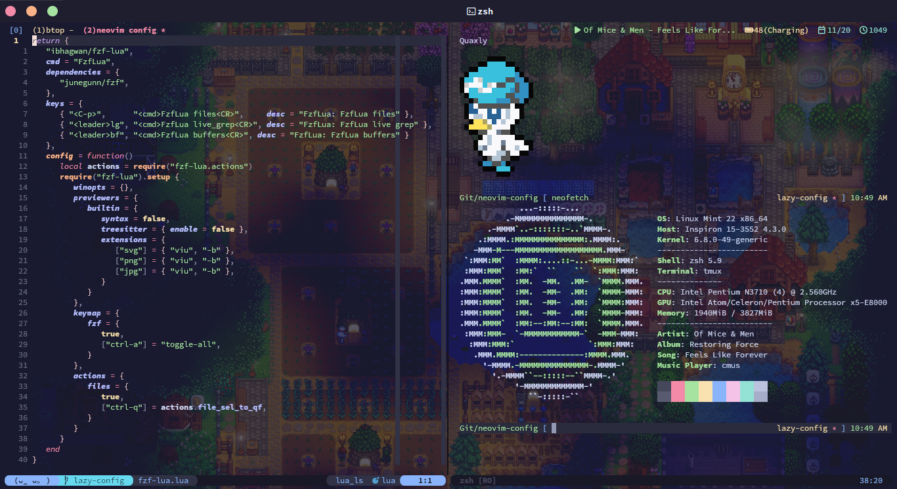

# My Neovim Setup

<br>

## Fully converted to Lua configuration

<br>

### Screenshots






### Tools I use or need

* Fedora 36 OS
* zsh (oh-my-zsh)
* Kitty Terminal (coz it supports font ligature and other utf-8 symbols)
* npm
* python3 (for pyright LSP)
* clang (for clangd LSP)
* java-devel (for jdtls LSP)
* ctags (for tagbar to work)
* go (for sqls LSP)
* lua (for sumneko_lua LSP)
* composer (for phpactor LSP)
* neovim v0.8.0
* vim-plug
* Tabs is better than Spaces
* Fira Code Nerd Font and Victor Mono Font for sweet cursive italics (configured in Kitty)

<br>

### Plugins

I use ```vim-plug``` as a Plugin Manager

#### Navigation

* junegunn/fzf
* ibhagwan/fzf-lua
* preservim/tagbar
* christoomey/vim-tmux-navigator
* jeffkreeftmeijer/vim-numbertoggle
* nvim-tree/nvim-tree.lua
* stevearc/aerial.nvim

#### Syntax Highlighting

* nvim-treesitter/nvim-treesitter

#### Auto-Completion

* gregsexton/MatchTag
* AndrewRadev/tagalong.vim.git
* neovim/nvim-lspconfig
* williamboman/nvim-lsp-installer
* hrsh7th/cmp-nvim-lsp
* hrsh7th/cmp-buffer
* hrsh7th/cmp-path
* hrsh7th/cmp-cmdline
* hrsh7th/nvim-cmp
* hrsh7th/cmp-vsnip
* hrsh7th/vim-vsnip
* windwp/nvim-ts-autotag

Lightweight Alternatives:

* maxboisvert/vim-simple-complete
* ackyshake/VimCompletesMe

#### Aesthetic or UI

* lukas-reineke/indent-blankline.nvim
* nvim-lualine/lualine.nvim
* catppuccin/nvim
* akinsho/bufferline.nvim
* SmiteshP/nvim-navic
* nvim-tree/nvim-web-devicons
* gorbit99/codewindow.nvim

#### Quality of Life

* tpope/vim-fugitive
* idanarye/vim-merginal
* norcalli/nvim-colorizer.lua
* nvim-treesitter/nvim-treesitter-context
* numToStr/Comment.nvim
* nullchilly/fsread.nvim
* davidgranstrom/nvim-markdown-preview
* manzeloth/live-server
* RRethy/vim-illuminate

<br>
