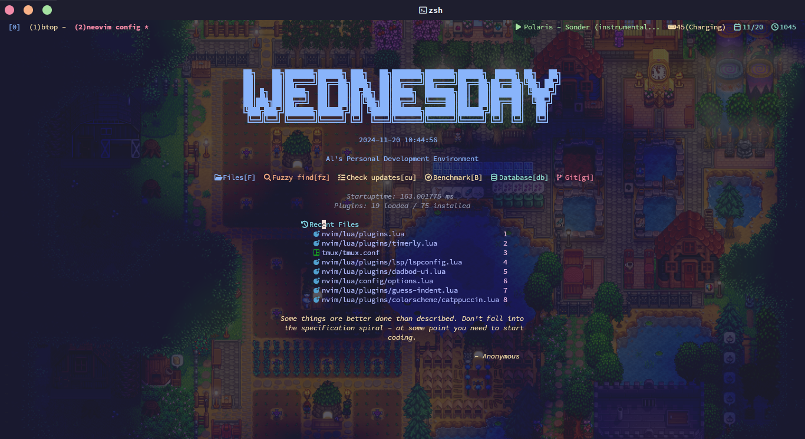

# My Neovim Configs

### Screenshots




### Tools I use or need

* Fedora 36 OS
* zsh (oh-my-zsh)
* Kitty Terminal (coz it supports font ligature and other utf-8 symbols)
* npm
* python3 (for pyright LSP)
* clang (for clangd LSP)
* java-devel (for jdtls LSP)
* ctags (for tagbar to work)
* go (for sqls LSP)
* lua (for sumneko_lua LSP)
* composer (for phpactor LSP)
* neovim v0.8.0
* vim-plug
* Tabs is better than Spaces
* Fira Code Nerd Font and Victor Mono Font (configured in Kitty)

<br>

### Plugins

I use ```vim-plug``` as a Plugin Manager

#### Navigation

* junegunn/fzf
* ibhagwan/fzf-lua
* preservim/tagbar
* christoomey/vim-tmux-navigator
* jeffkreeftmeijer/vim-numbertoggle
* nvim-lua/plenary.nvim
* nvim-telescope/telescope.nvim
* nvim-tree/nvim-tree.lua
* stevearc/aerial.nvim

#### Syntax Highlighting

* sheerun/vim-polyglot
* nvim-treesitter/nvim-treesitter

#### Auto-Completion

* gregsexton/MatchTag
* vim-scripts/c.vim
* AndrewRadev/tagalong.vim.git
* neovim/nvim-lspconfig
* williamboman/nvim-lsp-installer
* hrsh7th/cmp-nvim-lsp
* hrsh7th/cmp-buffer
* hrsh7th/cmp-path
* hrsh7th/cmp-cmdline
* hrsh7th/nvim-cmp
* hrsh7th/cmp-vsnip
* hrsh7th/vim-vsnip

Lightweight Alternatives:

* maxboisvert/vim-simple-complete
* ackyshake/VimCompletesMe

#### Aesthetic or UI

* lukas-reineke/indent-blankline.nvim
* nvim-lualine/lualine.nvim
* ghifarit53/tokyonight-vim
* catppuccin/nvim
* Rigellute/shades-of-purple.vim
* ghifarit53/tokyonight-vim
* RRethy/vim-illuminate
* akinsho/bufferline.nvim
* SmiteshP/nvim-navic
* nvim-tree/nvim-web-devicons
* gorbit99/codewindow.nvim
* folke/tokyonight.nvim

#### Quality of Life

* tpope/vim-fugitive
* idanarye/vim-merginal
* norcalli/nvim-colorizer.lua
* alvan/vim-closetag
* dense-analysis/ale
* nvim-treesitter/nvim-treesitter-context
* numToStr/Comment.nvim
* nullchilly/fsread.nvim

<br>

### Plugin Configs

* [nvim-cmp](#nvim-cmp)
* [lspconfig](#lspconfig)
* [nvim-lsp-installer](#nvim-lsp-installer)
* [indent-blankline](#indent-blankline)
* [lualine](#lualine)
* [nvim-treesitter](#nvim-treesitter)
* [telescope](#telescope)
* [bufferline](#bufferline)
* [fzf-lua](#fzf-lua)
* [vim-illuminate](#vim-illuminate)
* [vim-closetag](#vim-closetag)
* [ale](#ale)
* [nvim-tree](#nvim-tree)
* [tagbar](#tagbar)
* [aerial](#aerial)
* [codewindow](#codewindow)

<br>

#### nvim-cmp

```lua
-- lua
local cmp = require'cmp'

cmp.setup({
    snippet = {
        -- REQUIRED - you must specify a snippet engine
        expand = function(args)
          vim.fn["vsnip#anonymous"](args.body) -- For `vsnip` users.
        end,
    },
    window = {
        completion = cmp.config.window.bordered(),
        -- documentation = cmp.config.window.bordered(),
    },
    mapping = cmp.mapping.preset.insert({
        ['<C-b>'] = cmp.mapping.scroll_docs(-4),
        ['<C-f>'] = cmp.mapping.scroll_docs(4),
        ['<C-Space>'] = cmp.mapping.complete(),
        ['<C-e>'] = cmp.mapping.abort(),
        ['<CR>'] = cmp.mapping.confirm({ select = true }), -- Accept currently selected item. Set `select` to `false` to only confirm explicitly selected items.
        ["<Tab>"] = cmp.mapping(function(fallback)
            if cmp.visible() then
                cmp.select_next_item()
            else
                fallback()
            end
        end, { "i", "s" }),
        ["<S-Tab>"] = cmp.mapping(function(fallback)
            if cmp.visible() then
                cmp.select_prev_item()
            -- elseif luasnip.jumpable(-1) then
            --    luasnip.jump(-1)
            else
                fallback()
            end
        end, { "i", "s" }),
    }),
    sources = cmp.config.sources({
        { name = 'nvim_lsp' },
        { name = 'vsnip' }, -- For vsnip users.
    }, {
        { name = 'buffer' },
    })
})

-- Set configuration for specific filetype.
cmp.setup.filetype('gitcommit', {
    sources = cmp.config.sources({
        { name = 'cmp_git' }, -- You can specify the `cmp_git` source if you were installed it.
    }, {
        { name = 'buffer' },
    })
})

-- Use buffer source for `/` and `?` (if you enabled `native_menu`, this won't work anymore).
cmp.setup.cmdline({ '/', '?' }, {
    mapping = cmp.mapping.preset.cmdline(),
    sources = {
        { name = 'buffer' }
    }
})

-- Use cmdline & path source for ':' (if you enabled `native_menu`, this won't work anymore).
cmp.setup.cmdline(':', {
    mapping = cmp.mapping.preset.cmdline(),
    sources = cmp.config.sources({
        { name = 'path' }
    }, {
        { name = 'cmdline' }
    })
})
```

#### lspconfig

```lua
-- lua
-- nvim-navic plugin
local navic = require("nvim-navic")
local navic_on_attach = function(client, bufnr)
    if client.server_capabilities.documentSymbolProvider then
        return navic.attach(client, bufnr)
    end
end

-- cmp-nvim-lsp plugin
local capabilities = require('cmp_nvim_lsp').default_capabilities()

-- python
require('lspconfig')['pyright'].setup {
    capabilities = capabilities,
    on_attach = navic_on_attach
}

-- java
require('lspconfig')['jdtls'].setup{
    capabilities = capabilities,
    on_attach = navic_on_attach
}

-- hmtl
require('lspconfig')['html'].setup{
    capabilities = capabilities,
    on_attach = navic_on_attach
}

-- c, c++, objective c, c#
require('lspconfig')['clangd'].setup{
    capabilities = capabilities,
    on_attach = navic_on_attach
}

-- lua
require('lspconfig')['sumneko_lua'].setup{
    capabilities = capabilities,
    on_attach = navic_on_attach
}

-- php
require('lspconfig')['intelephense'].setup{
    capabilities = capabilities,
    on_attach = navic_on_attach
}

-- php
require('lspconfig')['phpactor'].setup{
    capabilities = capabilities,
}

-- vimscript
require('lspconfig')['vimls'].setup{
    capabilities = capabilities,
    on_attach = navic_on_attach
}

-- sql
require('lspconfig')['sqls'].setup{
    capabilities = capabilities,
    on_attach = navic_on_attach
}

-- R
require('lspconfig')['r_language_server'].setup{
    capabilities = capabilities,
    on_attach = navic_on_attach
}

-- css
require('lspconfig')['cssls'].setup{
    capabilities = capabilities,
    on_attach = navic_on_attach
}

-- markdown
require('lspconfig')['marksman'].setup{
    capabilities = capabilities,
    on_attach = navic_on_attach
}
```

#### nvim-lsp-installer

```lua
require'nvim-lsp-installer'.setup({
    automatic_installation = true, -- automatically detect which servers to install (based on which servers are set up via lspconfig)
    ui = {
        icons = {
            server_installed = "✓",
            server_pending = "➜",
            server_uninstalled = "✗"
        }
    }
})
```

#### indent-blankline

```lua
-- lua
vim.opt.list = true
vim.opt.termguicolors = true
vim.cmd [[highlight IndentBlanklineIndent1 guifg=#2c2c2c gui=nocombine]]
require("indent_blankline").setup {
    space_char_blankline = " ",
    char_highlight_list = {
        "IndentBlanklineIndent1",
    },
}
```

#### lualine

```lua
-- lua
local navic = require("nvim-navic")

-- rename mode names to shorter ones
local mode_map = {
    n = "NOR",
    nt = "NOR",
    i = "INS",
    R = "REP",
    v = "VIS",
    V = "VLI",
    no = "CHA",
    ["\22"] = "VBL",
    t = "TER",
    ['!'] = "SH",
    c = "COM"
}

-- this function is mainly for winbar
function custom_filename_path()
    local modified_symbol = ""
    local readonly_symbol = ""
    local navic_location = ""

    -- relative path, replace directory slashes to a bigger arrow
    local file_name = string.gsub(vim.fn.expand('%:~:.'), '/', "  ")

    -- enable navic if it's available
    if navic.is_available() and navic.get_location() ~= "" then
        navic_location = "  " .. navic.get_location()
    end

    -- if the current file is modified
    if vim.bo.modified then
        modified_symbol = " ●"
    end

    -- if the current file is readonly
    if vim.bo.readonly then
        readonly_symbol = " [RO]"
    end

    -- returns the stuff that is being outputted in winbar
    return file_name .. navic_location .. readonly_symbol .. modified_symbol
end

function buffer_name(buf)
    return buf.name
end

require('lualine').setup {
    options = {
        icons_enabled = false,
        theme = 'molokai',
        -- section_separators = { left = '', right = ''},
        -- component_separators = { left = '', right = ''},
        component_separators = '',
        section_separators = {
            left = '',
            right = ''
        },
        disabled_filetypes = {
            statusline = {},
            winbar = {},
        },
        ignore_focus = {},
        always_divide_middle = true,
        globalstatus = false,
        refresh = {
            statusline = 1000,
            tabline = 1000,
            winbar = 1000,
        },
    },

    sections = {
        lualine_a = {
            {'mode',
                icons_enabled = true,
                separator = {
                    right = ''
                },
                fmt = function()
                    return mode_map[vim.api.nvim_get_mode().mode] or vim.api.nvim_get_mode().mode
                end
            },
        },
        lualine_b = {
            {'branch',
                color = {
                    bg = '#f92672',
                    fg = '#f7f5f5'
                },
                separator = {
                    -- right = ''
                    right = ''
                },
                icons_enabled = true,
            },
            {'diff',
                colored = true,
                color = {
                    bg = '#1a1b26',
                },
                diff_color = {
                    added = {
                        fg = '#9ece6a',
                    },
                    modified = {
                        fg = '#7dcfff',
                    },
                    removed = {
                        fg = '#f7768e',
                    },
                },
                symbols = {
                    added = '+',
                    modified = '~',
                    removed = '-',
                },
                separator = {
                    right = ''
                },
                source = nil,
            },
        },
        lualine_c = {
            {'diagnostics',
                color = {
                    bg = '#1a1b26',
                },
                sources = { 'nvim_diagnostic', 'coc', 'ale', 'nvim_lsp' },
                sections = { 'error', 'warn', 'info', },
                symbols = {
                    error = ' ',
                    warn = ' ',
                    info = ' ',
                },
                colored = true,
                update_in_insert = false,
                always_visible = false,
                separator = {
                    right = ''
                }
            },
        },
        lualine_x = {},
        lualine_y = {'encoding', 'filetype', 'progress'},
        lualine_z = {
            {'location',
                separator = {
                    left = '',
                }
            }
        }
    },

    inactive_sections = {
        lualine_a = {
            {'diff',
                colored = true,
                color = {
                    bg = '#1a1b26',
                },
                diff_color = {
                    added = {
                        fg = '#9ece6a',
                    },
                    modified = {
                        fg = '#7dcfff',
                    },
                    removed = {
                        fg = '#f7768e',
                    },
                },
                symbols = {
                    added = '+',
                    modified = '~',
                    removed = '-',
                },
                separator = {
                    right = ''
                },
                source = nil,
            },
        },
        lualine_b = {
            {'diagnostics',
                color = {
                    bg = '#1a1b26',
                },
                sources = { 'nvim_diagnostic', 'coc', 'ale', 'nvim_lsp' },
                sections = { 'error', 'warn', 'info', },
                symbols = {
                    error = ' ',
                    warn = ' ',
                    info = ' ',
                },
                colored = true,
                update_in_insert = false,
                always_visible = false,
                separator = {
                    right = ''
                }
            },
        },
        lualine_c = {},
        lualine_x = {},
        lualine_y = {
            { 'encoding', 'filetype',
                color = {
                    fg = '#1a1b26',
                }
            },
            { 'filetype',
                color = {
                    fg = '#1a1b26',
                }
            }
        },
        lualine_z = {
            {'location',
                color = {
                    bg = '#66d9ef',
                    fg = '#1a1b26'
                },
                separator = {
                    left = '',
                },
            }
        }
    },

    winbar = {
        lualine_a = {
            {'filename',
                color = {
                    bg = '#474973',
                    fg = '#cdd6f4'
                },
                separator = {
                    right = ''
                },
                fmt = custom_filename_path
            },
        },
        lualine_b = {
        },
        lualine_c = {},
        lualine_x = {},
        lualine_y = {},
        lualine_z = {}
    },

    inactive_winbar = {
        lualine_a = {
            {'filename',
                color = {
                    bg = '#474973',
                    fg = '#cdd6f4'
                },
                separator = {
                    right = ''
                },
                fmt = custom_filename_path
            },
        },
        lualine_b = {},
        lualine_c = {},
    },

    extensions = {}
}
```

#### nvim-treesitter

```lua
-- lua
require'nvim-treesitter.configs'.setup {
    ensure_installed = { "c", "lua", "rust" },
    sync_install = false,
    auto_install = true,
    ignore_install = { "javascript" },
    highlight = {
        enable = true,
        additional_vim_regex_highlighting = false,
    },
}
```

#### telescope

```lua
-- lua
local builtin = require('telescope.builtin')
local actions = require("telescope.actions")

-- builtin keymaps
vim.keymap.set('n', '<leader>ff', builtin.find_files, {})
vim.keymap.set('n', '<leader>fg', builtin.live_grep, {})
vim.keymap.set('n', '<leader>fb', builtin.buffers, {})
vim.keymap.set('n', '<leader>fh', builtin.help_tags, {})

require('telescope').setup{
    defaults = {
        mappings = {
            i = {
                ["<C-j>"] = actions.move_selection_next,
                ["<C-k>"] = actions.move_selection_previous,
                ["<C-s>"] = actions.select_horizontal,
            }
        },
        layout_strategy = 'horizontal',
        layout_config = {
            horizontal = {
                height = 0.9,
                prompt_position = 'bottom',
                width = 0.9,
                preview_cutoff = 10
            }
        }
    }
}
```

#### bufferline

```lua
-- lua
require('bufferline').setup {
    options = {
        always_show_bufferline = true,
        mode = "tabs",
        truncate_names = false,
        name_formatter = function(buf)
            return buf.name
        end,
        numbers = "ordinal",
        indicator = {
            style = "none"
        },
        separator_style = "slant",
        diagnostics = "nvim_lsp"
    }
}
```

#### fzf-lua

```vim
" vim-script
nnoremap <c-P> <cmd>lua require('fzf-lua').files()<CR>
```

#### vim-illuminate

```vim
" vim-script
hi link IlluminatedWordText Visual
hi link IlluminatedWordRead Visual
hi link IlluminatedWordWrite Visual
```

#### vim-closetag

```vim
" vim-script
let g:closetag_filenames = '*.html,*.xhtml,*.phtml,*.php'
let g:closetag_filetypes = 'html,xhtml,phtml,php'
let g:closetag_emptyTags_caseSensitive = 1
let g:closetag_shorcut = '>'
let g:closetag_close_shortcut = '<leader>>'
```

#### ale

```vim
" vim-script
nmap ]a :ALENextWrap<CR>
nmap [a :ALEPreviousWrap<CR>
nmap ]A :ALELast<CR>
nmap [A :ALEFirst<CR>
```

#### nvim-tree

```vim
" vim-script
nmap <leader>F :NvimTreeToggle <CR>
nmap <leader><leader>f :NvimTreeToggle <CR>
nmap <F6> :NvimTreeToggle <CR>
```

```lua
-- lua
vim.g.loaded_netrw = 1
vim.g.loaded_netrwPlugin = 1
vim.opt.termguicolors = true

-- empty setup using defaults
require("nvim-tree").setup{
    sort_by = "name",
    view = {
        adaptive_size = false,
        number = false,
        relativenumber = false,
    },
    renderer = {
        add_trailing = true,
        group_empty = false,
        indent_markers = {
            enable = false,
            inline_arrows = false,
            icons = {
                corner = "└",
                edge = "│",
                item = "│",
                bottom = "─",
                none = " ",
            },
        }
    },
    diagnostics = {
        enable = false,
        show_on_dirs = false,
        debounce_delay = 50,
        icons = {
            hint = "",
            info = "",
            warning = "",
            error = "",
        },
    },
}
```

#### tagbar

```vim
" vim-script
let g:tagbar_sort = 0
nmap <F8> :TagbarToggle<CR>
nmap <leader>tt :TagbarToggle <CR>
```

#### aerial

```lua
-- lua
require('aerial').setup({
    -- optionally use on_attach to set keymaps when aerial has attached to a buffer
    on_attach = function(bufnr)
        -- Jump forwards/backwards with '{' and '}'
        vim.keymap.set('n', '{', '<cmd>AerialPrev<CR>', {buffer = bufnr})
        vim.keymap.set('n', '}', '<cmd>AerialNext<CR>', {buffer = bufnr})
    end,

    filter_kind = false
})
```

#### codewindow

```lua
-- lua
require('codewindow').setup{
    active_in_terminals = false,
    auto_enable = false,
    exclude_filetypes = {},
    max_minimap_height = nil,
    max_lines = nil,
    minimap_width = 15,
    use_lsp = true,
    use_treesitter = true,
    use_git = true,
    width_multiplier = 2,
    z_index = 1,
    show_cursor = true,
    window_border = 'single'
}

require('codewindow').apply_default_keybinds()
```

<br>
